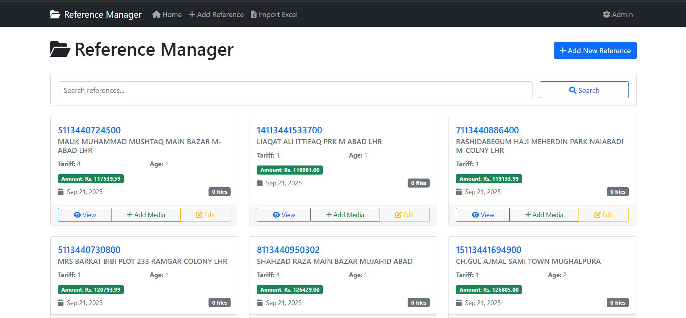

# Reference Manager - Django Application

A comprehensive Django web application for managing reference numbers with media files, categories, and Excel import/export functionality.

## 📸 Screenshots

### Main Dashboard

*Home page showing all references with search functionality and reference cards*

### Reference Detail Page

*Detailed view of a reference with all information and media files*

### Excel Import Interface

*Excel import page with template download and file upload functionality*

## Features

### 📋 Core Features
- **Reference Management**: Create, edit, and manage reference numbers with detailed information
- **Media File Support**: Upload and manage images (JPG, PNG, GIF) and PDF files
- **Category System**: Organize media files with multiple categories (Court Case, Payment Receipt, Site Picture, etc.)
- **Excel Import/Export**: Bulk import references from Excel files with update/create functionality
- **Search & Filter**: Search references by number, title, or description
- **Responsive Design**: Modern, mobile-friendly interface using Bootstrap

### 💰 Financial Features
- **Amount Tracking**: Store monetary amounts in Indian Rupees (Rs.)
- **Tariff Management**: Track tariff information for each reference
- **Age Tracking**: Record age information for references

### 📊 Data Management
- **Admin Interface**: Full Django admin for data management
- **Media Organization**: Automatic file organization by date
- **Remarks System**: Add remarks to both references and individual media files
- **Bulk Operations**: Import multiple references at once via Excel

## Technology Stack

- **Backend**: Django 5.2.6
- **Database**: SQLite (default) - easily configurable for PostgreSQL/MySQL
- **Frontend**: HTML5, CSS3, JavaScript, Bootstrap 5
- **File Handling**: Pillow for image processing, openpyxl for Excel operations
- **Icons**: Font Awesome 6

## Installation & Setup

### Prerequisites
- Python 3.8 or higher
- pip (Python package installer)

### Step 1: Clone or Download the Project
```bash
# If using git
git clone <repository-url>
cd reference-manager

# Or download and extract the project files
```

### Step 2: Create Virtual Environment (Recommended)
```bash
# Create virtual environment
python -m venv venv

# Activate virtual environment
# On Windows:
venv\Scripts\activate
# On macOS/Linux:
source venv/bin/activate
```

### Step 3: Install Dependencies
```bash
pip install -r requirements.txt
```

### Step 4: Database Setup
```bash
# Navigate to the project directory
cd reference_manager

# Create database migrations
python manage.py makemigrations

# Apply migrations
python manage.py migrate

# Create sample categories
python manage.py create_sample_categories
```

### Step 5: Create Superuser (Admin Account)
```bash
python manage.py createsuperuser
# Follow the prompts to create an admin account
```

### Step 6: Run the Development Server
```bash
python manage.py runserver
```

The application will be available at: `http://localhost:8000/`

## Project Structure

```
reference_manager/
├── manage.py
├── requirements.txt
├── README.md
├── reference_manager/
│   ├── __init__.py
│   ├── settings.py
│   ├── urls.py
│   ├── wsgi.py
│   └── asgi.py
└── references/
    ├── __init__.py
    ├── admin.py
    ├── apps.py
    ├── models.py
    ├── views.py
    ├── forms.py
    ├── urls.py
    ├── management/
    │   └── commands/
    │       ├── __init__.py
    │       └── create_sample_categories.py
    └── templates/
        └── references/
            ├── base.html
            ├── home.html
            ├── reference_detail.html
            ├── add_reference.html
            ├── edit_reference.html
            ├── add_media.html
            └── import_excel.html
```

## Usage Guide

### 1. Adding References
- Navigate to the home page
- Click "Add New Reference"
- Fill in the required fields:
  - Reference Number (unique)
  - Title
  - Tariff (optional)
  - Age (optional)
  - Amount in Rupees (optional)
  - Description (optional)
  - Remarks (optional)

### 2. Managing Media Files
- Open any reference detail page
- Click "Add Media" to upload files
- Select file type (Image or PDF)
- Choose categories for the media file
- Add remarks if needed

### 3. Excel Import
- Click "Import Excel" in the navigation
- Download the template to see the required format
- Fill your data in the Excel file with columns:
  - `reference_number` (required)
  - `title` (required)
  - `tariff` (optional)
  - `age` (optional)
  - `amount` (optional)
  - `description` (optional)
- Upload the Excel file
- Review the import results

### 4. Admin Interface
- Access admin panel at `/admin/`
- Manage all data including categories, references, and media files
- Create and manage user accounts

## Excel Import Format

The Excel file should contain the following columns:

| Column | Required | Description | Example |
|--------|----------|-------------|---------|
| reference_number | Yes | Unique reference identifier | REF001 |
| title | Yes | Reference title | Sample Reference 1 |
| tariff | No | Tariff information | T1 |
| age | No | Age in years | 25 |
| amount | No | Amount in rupees | 100000.50 |
| description | No | Detailed description | Sample description 1 |

## Configuration

### Database Configuration
The application uses SQLite by default. To use PostgreSQL or MySQL:

1. Install the appropriate database adapter:
```bash
# For PostgreSQL
pip install psycopg2-binary

# For MySQL
pip install mysqlclient
```

2. Update `settings.py`:
```python
DATABASES = {
    'default': {
        'ENGINE': 'django.db.backends.postgresql',  # or mysql
        'NAME': 'your_database_name',
        'USER': 'your_username',
        'PASSWORD': 'your_password',
        'HOST': 'localhost',
        'PORT': '5432',  # or 3306 for MySQL
    }
}
```

### Media Files Configuration
Media files are stored in the `media/` directory. For production:

1. Set up proper media file serving
2. Configure `MEDIA_ROOT` and `MEDIA_URL` in settings
3. Use a cloud storage service like AWS S3 for scalability

## API Endpoints

- `/` - Home page with reference list
- `/reference/<id>/` - Reference detail page
- `/add-reference/` - Add new reference
- `/reference/<id>/add-media/` - Add media to reference
- `/reference/<id>/edit/` - Edit reference
- `/import-excel/` - Excel import page
- `/download-template/` - Download Excel template
- `/admin/` - Django admin interface

## Troubleshooting

### Common Issues

1. **Port already in use**:
   ```bash
   python manage.py runserver 8001
   ```

2. **Database migration errors**:
   ```bash
   python manage.py makemigrations --empty references
   python manage.py migrate
   ```

3. **Static files not loading**:
   ```bash
   python manage.py collectstatic
   ```

4. **Excel import errors**:
   - Ensure Excel file has correct column names
   - Check that required fields (reference_number, title) are not empty
   - Verify file format is .xlsx or .xls

### Development Tips

1. **Enable Debug Mode**: Set `DEBUG = True` in settings.py for development
2. **Logging**: Add logging configuration for better error tracking
3. **Testing**: Create test cases for new features
4. **Backup**: Regularly backup your database and media files

## Contributing

1. Fork the repository
2. Create a feature branch
3. Make your changes
4. Test thoroughly
5. Submit a pull request

## License

This project is open source and available under the MIT License.

## Support

For support and questions:
- Check the troubleshooting section above
- Review Django documentation: https://docs.djangoproject.com/
- Create an issue in the project repository

## Changelog

### Version 1.0.0
- Initial release
- Reference management system
- Media file support
- Excel import/export
- Category system
- Rupee currency support
- Responsive design

---

**Happy Reference Managing!** 📚✨
